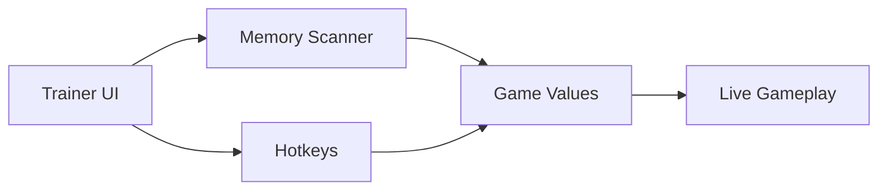

# Enshrouded Trainer — When Survival Needs Room to Breathe

The fog in **Enshrouded** is not just weather.
It is pressure.
It is time running out.
It is the quiet reminder that the world does not wait.

This **Enshrouded Trainer** exists for moments when you want to *learn* the land instead of fighting it endlessly. It is not spectacle-driven, not noisy, not reckless. It is a careful set of levers—mechanical, reversible, precise—designed for PvE players who want freedom without destruction.

---

## 🌲 What Is the Enshrouded Trainer?

A trainer is a quiet instrument.

Unlike mod menus or overlays, this tool focuses on **value control**: health, stamina, cooldowns, resources, and movement parameters. It runs externally on Windows, attaches safely to the game process, and applies changes in real time—without touching save files.

Why players use it:

* Practice combat without constant death loops
* Explore Shroud zones calmly
* Test builds and skills without grinding
* Build and craft without resource walls

When closed, everything returns to normal. The world remembers nothing—but you do.

---

## 🛡 Player Survival & State Control

Survival in Enshrouded is a negotiation. The trainer simply gives you more bargaining power.

### ❤️ Core Survival Options

* God Mode (toggle on/off)
* Infinite health
* Infinite stamina
* Freeze hunger & thirst
* No poison, no burn, no Shroud decay
* Temperature immunity (cold & heat)

These tools are ideal for deep exploration, boss learning, or long building sessions where interruption breaks immersion.

> [!IMPORTANT]
> All survival options can be activated independently—nothing is forced, nothing permanent.

---

## ⚔️ Combat & Skill Flow Adjustments

Combat in Enshrouded is deliberate and rhythmic. The trainer doesn’t erase that rhythm—it smooths the pauses.

### 🎯 Combat Features

* Damage multiplier (melee / ranged / magic)
* Defense scaling
* One-hit kill (optional, testing only)
* No skill cooldowns
* Infinite mana
* Cast speed adjustment

You can fine-tune values until combat feels challenging *without* being punishing.

---

## 🧱 Crafting, Tools & Progression Tweaks

Sometimes survival games confuse time investment with difficulty. This trainer quietly disagrees.

### 🛠 Crafting & Gear Options

* Free crafting (no material consumption)
* Instant crafting & refining
* Infinite tool durability
* No item weight
* Unlock all crafting recipes

Build first. Experiment freely.
Let creativity lead, not scarcity.

---

## 🧭 Movement, Physics & Exploration

The land is vertical. Dangerous. Beautiful.
The trainer lets you explore it without fear of missteps.

### 🌬 Exploration Tools

* Movement speed multiplier
* Sprint without stamina drain
* No fall damage
* Jump height adjustment
* Free camera mode (for scouting & screenshots)

These features are especially useful for mapping ruins, planning builds, or simply wandering through the fog with curiosity instead of anxiety.

---

## ⚙️ Interface & Usability

The Enshrouded Trainer interface is intentionally understated:

* Lightweight standalone window
* Clear categories (Player / Combat / Crafting / World)
* Hotkeys for every function
* Real-time sliders and toggles
* Save & load custom presets

No overlay clutter.
No visual pollution.
Just control, waiting patiently.

---

## ⚡ Setup — Nothing Dramatic Happens

Installation is intentionally uneventful:

1. Launch Enshrouded
2. Load into your world
3. Run the trainer as administrator
4. Wait for confirmation: *Process Attached*
5. Toggle features via hotkeys or menu

Close the trainer at any time—no lingering effects, no altered files.

---

## 🔁 How the Trainer Works

A short loop.
A quiet influence.
Nothing more.

---

## ❓ FAQ — From the Fog

**Is this a mod menu?**
No. This is a trainer focused on value control, not overlays or world injection.

**Can I save my settings?**
Yes. Profiles can be saved and loaded instantly.

**Does it modify save files?**
No. All changes are temporary and memory-based.

**Is it good for learning bosses?**
Absolutely. Many players use it to study mechanics without repeated deaths.

**Will game updates break it?**
Minor updates are usually handled quickly; major patches may require brief adjustments.

---

## 🌫 Final Thoughts

The fog in Enshrouded never truly lifts.
But sometimes, it softens.

This trainer does not conquer the world—it gives you space to understand it. To pause. To experiment. To breathe. When you turn it off, the danger returns—but so does your confidence.

Survival is louder when earned.
This tool simply lowers the noise.

---
